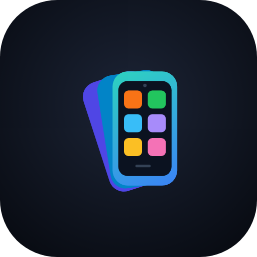
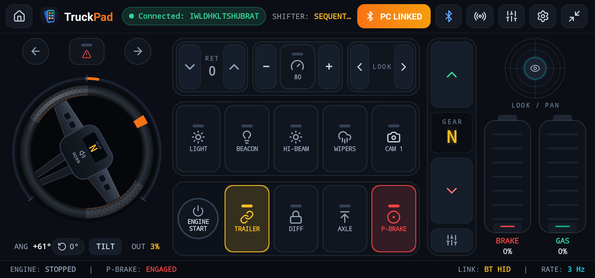
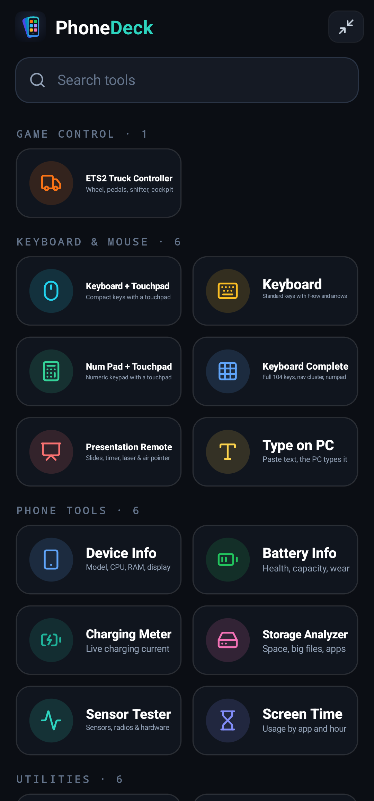
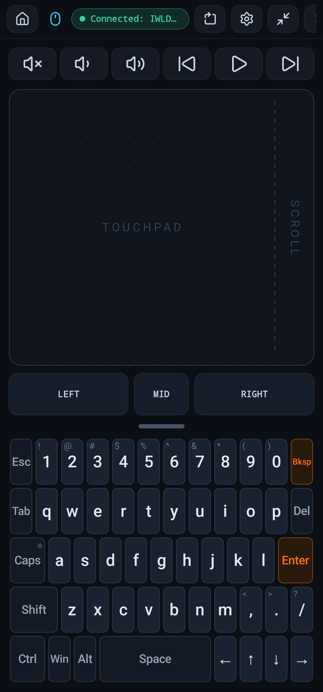
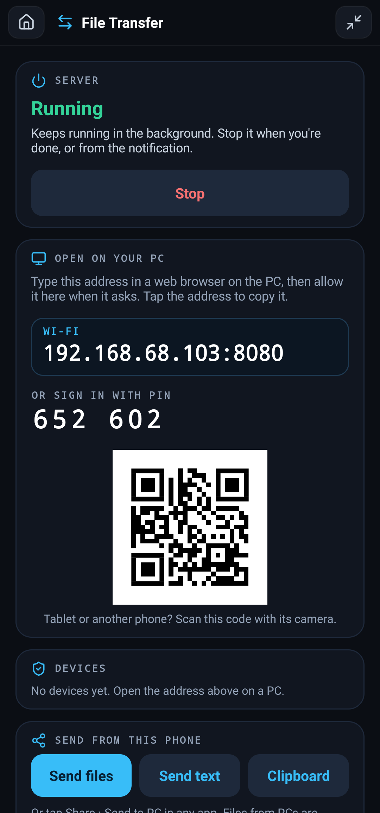
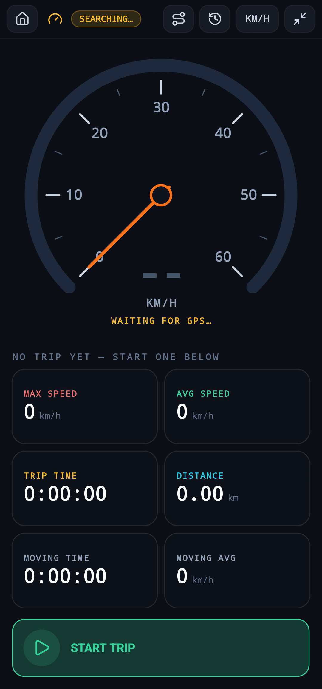

<div align="center">



# PhoneDeck

**Turn your Android phone into a Bluetooth steering wheel for Euro Truck Simulator 2, a wireless
keyboard, mouse and presentation remote, plus Wi-Fi file transfer and 15+ phone tools.
No software to install on the PC.**

[](https://github.com/ShubratoDn/PhoneDeck/releases/latest)
[](https://github.com/ShubratoDn/PhoneDeck/releases)


**[⬇ Download the APK](https://github.com/ShubratoDn/PhoneDeck/releases/latest)** ·
**[Website](https://shubratodn.github.io/PhoneDeck/)** ·
**[Installation guide](INSTALL.md)** ·
**[What's new](CHANGELOG.md)**

</div>

<p align="center">
  
</p>

<p align="center">
  
  
  
  
</p>

---

## Why PhoneDeck?

- **Your phone becomes a real PC controller.** It uses the Bluetooth HID profile built into
  Android 9+, so Windows, macOS and Linux see a normal Bluetooth gamepad, keyboard and mouse.
  No drivers, no server, no companion app on the PC.
- **Built for truck simulators.** A full Euro Truck Simulator 2 cockpit: steering wheel or tilt
  steering, analog gas and brake, shifter, retarder, cruise control and every cockpit switch.
- **Phone ⇄ PC over Wi-Fi from any browser.** Send files, folders, text and the clipboard, or watch
  the phone camera or screen live, with nothing to install on the PC.
- **A toolbox for the phone itself.** Hardware and sensor tests, battery health, storage
  analysis, screen time, GPS speedometer with routes on a map, QR tools and more.
- **Private by design.** Phone tools work offline; nothing leaves the phone unless you send it to
  a PC on your own network.

---

## Features

### Use your phone as a steering wheel for Euro Truck Simulator 2

- **Steering wheel** with 360°–1800° rotation, auto-centering spring, deadzone and response curve,
  or **tilt steering**: turn the whole phone like a wheel
- **Analog gas and brake pedals**, with a gentle brake curve and adjustable brake strength
- **Vertical sequential shifter** right next to the pedals, plus shifter modes
- **Retarder, cruise control** and cruise speed ±, engine start, parking brake
- **Cockpit switches**: lights, high beam, beacon, hazards, blinkers, wipers, differential lock,
  lift axle, trailer, camera
- **Look pad** to look around (tap it for the interior camera), quick look left / right, air horn,
  optional CB radio with push-to-talk
- Truck sounds and haptic feedback; works with any game that accepts a standard controller

### Use your phone as a Bluetooth keyboard and mouse for your PC

| Tool | What you get |
|---|---|
| **Keyboard + Touchpad** | Compact keyboard next to (or, in portrait, below) a touchpad with Left / Middle / Right buttons |
| **Keyboard** | Standard layout with F-keys, symbols and arrows |
| **Num Pad + Touchpad** | Numeric keypad with Num Lock indicator and a large touchpad |
| **Keyboard Complete** | Full 104-key layout: F-row, navigation cluster, arrows and numpad |
| **Presentation Remote** | Next / previous slide, talk timer, black screen, laser pointer, and a pointer pad that works as a touchpad or an **air pointer** (point the phone at the screen); the volume keys change slides |
| **Type on PC** | Paste text on the phone and the PC types it out: passwords, codes, long text |

Touchpad gestures (tap, two- / three-finger tap, two-finger scroll, drag), sticky and lockable
modifiers, Caps / Num Lock indicators that follow the PC, media keys, portrait or landscape.

### Transfer files between your phone and PC over Wi-Fi (no app on the PC)

**File Transfer** turns the phone into a small web server on your Wi-Fi or hotspot. Open its address
in any browser on a PC and:

- **Send files, folders and text** between the phone and PCs, or **PC to PC** through the phone
- **Sync the clipboard**: Ctrl + V on the PC puts text on the phone; the phone's clipboard reaches the PC
- **Browse the phone's files** only if you allow it, with per-device access levels
- **Share from any app**: *Share › Send to PC*

New browsers must be **approved on the phone** (with a matching code) and can't see any files
unless you give them access. There's a PIN option, remembered devices and a security log.

### Watch your phone camera or screen live in a PC browser

**Live View** streams the phone camera (security or document camera: switch lens, light, rotate,
full-resolution snapshots) or **mirrors the phone screen**, up to original quality. Only devices you
approved can watch, and only while you share.

### Phone tools and hardware tests

| Tool | What it does |
|---|---|
| **Device Info** | Model, Android version, processor, RAM (live), display, cameras and hardware features |
| **Battery Info** | Health, temperature, voltage, design vs. estimated capacity, wear, cycle count, charger rating |
| **Charging Meter** | Live charge / discharge current, power, min / max and a current graph |
| **Storage Analyzer** | Space used by apps, photos, videos and audio; largest files and apps |
| **Sensor Tester** | 12 hardware tests (GPS, Wi-Fi, Bluetooth, NFC, mobile network, cameras, flashlight, fingerprint & face, microphones, speakers, buttons, infrared), touch / display / vibration tests and a live view of every sensor |
| **Screen Time** | Daily and weekly screen time, unlocks, longest session and per-app usage |

### Utilities

| Tool | What it does |
|---|---|
| **Speedometer** | GPS speed and trips (distance, time, max and average speed) with each **trip's route on an OpenStreetMap map**: live while driving, coloured by speed afterwards, exportable as GPX |
| **Night Screen** | Dims the screen below the lowest brightness; control it from the notification or Quick Settings |
| **Scanner** | QR codes and barcodes, with actions for links, Wi-Fi and contacts, or typing the code on the PC |
| **QR & Barcode Maker** | QR codes in many designs, plus Code 128, EAN-13, EAN-8, UPC-A and Code 39 barcodes |

### Root tools (optional)

| Tool | What it does |
|---|---|
| **Charging Animation** | Custom lock screen charging animations on HyperOS / MIUI through an LSPosed module, shown for 30 seconds or 5 minutes |

---

## Download and install

1. Download **PhoneDeck-1.0.0.apk** from the
   **[latest release](https://github.com/ShubratoDn/PhoneDeck/releases/latest)**.
2. Open it on the phone and allow *Install unknown apps* when asked.
3. Open **PhoneDeck**. The home screen lists every tool; type in the search box to find one
   (for example "wheel", "keyboard", "transfer" or "battery").

Step-by-step help, including pairing and Xiaomi tips: **[INSTALL.md](INSTALL.md)**.

### Requirements

| | |
|---|---|
| Phone | Android 9 (API 28) or newer. PC control needs Bluetooth; a few manufacturer systems disable the Bluetooth HID Device profile, in which case the PC tools stay "Offline" (all phone tools still work) |
| PC | Any computer with Bluetooth for the game and keyboard & mouse tools (tested with Windows 11). File Transfer and Live View need only a web browser on the same network |

---

## Pairing with the PC

1. Open the **ETS2 Truck Controller** or any **Keyboard & Mouse** tool and allow the **Nearby
   devices** (Bluetooth) permission.
2. In the pairing dialog (or the Bluetooth button in the header) tap **Make visible**.
3. On the PC open **Bluetooth settings → Add device** and select the phone.
4. The status pill turns green: **Connected**.

The app reconnects to the same PC automatically afterwards. One connection is shared by all PC
tools. On the PC the controller is named **TruckPad**.

> **Re-pair after updates that change the controller layout.** The PC stores the device description
> when pairing. If the app shows *Connected* but nothing reacts, remove the phone in the PC's
> Bluetooth settings, unpair the PC on the phone, and pair again.

To check the controller on Windows, press **Win + R**, run `joy.cpl`, select **TruckPad** and open
**Properties**.

---

## Setting up Euro Truck Simulator 2

1. Connect the phone **before** starting the game.
2. Open **Options → Controls** and select **TruckPad** as the input device.
3. Bind the axes by clicking an action in the game and moving the control in the app:

| ETS2 action | App control | Axis |
|---|---|---|
| Steering | Steering wheel | X (`joy.x`) |
| Throttle | GAS pedal | Slider (`joy.sl1`) |
| Brake | BRAKE pedal | Dial / 2nd slider (`joy.sl2`) |
| Look left / right | Look pad, sideways | Rx (`joy.rx`) |
| Look up / down | Look pad, up / down | Ry (`joy.ry`) |

Use **full range** for the pedals; if a pedal reads 100 % while released, enable **Invert** for it.
Set the game's steering non-linearity to 0 %; the app already applies its own curve.

4. Bind the buttons: in the app open **Button mappings** (sliders icon in the header) and tap a row
   to send that button while ETS2 is waiting for input.

| Button | Action | Button | Action |
|---|---|---|---|
| 1 | Gear up | 14 | Right blinker |
| 2 | Gear down | 15 | Hazard lights |
| 3 | Splitter | 16 | Light modes |
| 4 | Range | 17 | Beacon |
| 5 | Engine start / stop | 18 | High beam |
| 6 | Parking brake | 19 | Wipers |
| 7 | Retarder + | 20 | Cruise control |
| 8 | Retarder − | 21 | Cruise speed + |
| 9 | Horn (held) | 22 | Cruise speed − |
| 10 | Attach / detach trailer | 23 | Camera |
| 11 | Differential lock | 24 | Look left |
| 12 | Lift axle | 25 | Look right |
| 13 | Left blinker | 26 | CB push-to-talk (held) |

Toggle actions are sent as a short press; horn and CB push-to-talk are held while touched.
Tapping the look pad sends keyboard key **1** (ETS2's interior camera by default).

**Recommended game settings:** *Options › Gameplay › Brake intensity* around 1.0 (the app has its
own brake strength setting), and *Transmission* set to **Automatic** or **Sequential**. In
*Simple automatic* the game itself reverses on the brake pedal when stopped.

---

## FAQ

**Do I need to install anything on my PC?**
No. The controller, keyboard and mouse tools use Bluetooth like any wireless gamepad or keyboard.
File Transfer and Live View open in a normal web browser.

**Does it work with American Truck Simulator or other games?**
The phone appears as a standard Bluetooth game controller, so any game that supports controllers
can use it. The cockpit layout and button list are designed around Euro Truck Simulator 2, which
shares its controls with American Truck Simulator.

**Do I need root?**
No. Everything works without root except the optional *Charging Animation* tool, which needs an
LSPosed setup.

**Which phones are supported?**
Android 9 or newer. A few manufacturer systems turn off the Bluetooth HID Device profile; on those,
the PC tools can't connect, but every phone tool still works.

**Is it safe to use File Transfer on shared Wi-Fi?**
Every new browser must be approved on the phone, and new devices can only send and receive until
you give them access to folders. You can require a PIN, review connected devices, and turn it off
at any time; it also stops by itself when idle.

**Can I use it in multiplayer?**
The phone acts as an ordinary controller, the same as a gamepad or wheel.

**Why does the app need so many permissions?**
Each tool asks only for what it uses, when you open it: Bluetooth for PC control, location for the
speedometer, camera for the scanner and Live View, and so on.

---

## Build from source

```bash
git clone https://github.com/ShubratoDn/PhoneDeck.git
cd PhoneDeck/android
./gradlew assembleDebug          # Windows: gradlew.bat assembleDebug
```

Needs JDK 17+ and the Android SDK (platform and build tools 35). If Gradle can't find the SDK,
create `android/local.properties` with `sdk.dir=/path/to/Android/Sdk`.

Install with USB debugging enabled: `adb install -r app/build/outputs/apk/debug/app-debug.apk`
(on Xiaomi phones also enable *Developer options → Install via USB*).

Release builds (`./gradlew assembleRelease`) are signed with a key kept outside the repository, read
from `~/PhoneDeck-keys/keystore.properties`; without it the release APK is left unsigned.

---

## How it works

The phone registers **one composite Bluetooth HID device** with four report IDs:

| Report ID | Collection | Contents |
|---|---|---|
| 1 | Keyboard | Modifier byte, 6-key rollover, Num / Caps / Scroll Lock LEDs |
| 2 | Mouse | 5 buttons, relative X / Y, vertical wheel, horizontal pan |
| 3 | Gamepad (ETS2) | 16-bit steering, look Rx / Ry, pedal Slider / Dial, hat, 32 buttons |
| 4 | Consumer control | Media and volume keys |

Every stick-type axis rests at its center and the pedals use slider axes, so the controller never
moves the game's menu cursor while idle. Reports are sent from a dedicated thread; analog and mouse
motion are coalesced to about 120 reports per second.

File Transfer and Live View run a small HTTP server inside the app (foreground service). Browsers
get a page from the app itself, live updates over Server-Sent Events, and camera / screen frames as
an MJPEG stream.

### Project structure

```
android/                              Android app (Kotlin)
  app/src/main/java/com/truckcontroller/pro/
    HomeActivity.kt                   Home screen: searchable tool hub
    MainActivity.kt                   ETS2 truck controller screen
    InputActivity.kt                  Keyboard & mouse tools
    HidActivity.kt                    Shared Bluetooth permission / pairing / header logic
    ToolActivity.kt                   Shared layout for the phone tools
    FileTransferActivity.kt           File Transfer, Live View and clipboard on the phone
    bluetooth/BluetoothHidService.kt  HID descriptor and report sending
    transfer/                         Web server, devices and approvals, camera / screen sharing
    input/                            Keyboard layouts, touchpad, air pointer, tilt sensor
    ui/                               Steering wheel, pedals, look pad, tiles, dialogs
    hardware/, sensors/, battery/, screentime/, speed/, scan/, qr/, dimmer/, charging/
  app/src/main/assets/transfer/       Browser page served to the PC by File Transfer
site/                                 Project website (GitHub Pages)
src/                                  Original web prototype of the cockpit UI (React + Vite)
```

---

## Troubleshooting

| Problem | Fix |
|---|---|
| PC tools stay **Offline** after pairing | Tap the Bluetooth button in the header and select the PC, or remove and re-pair the phone |
| PC can't find the phone | Tap **Make visible** again; visibility lasts 2 minutes |
| *Connected*, but keys / mouse / controller do nothing | Re-pair (see above); the PC still has an older device description |
| ETS2 doesn't list the controller | Connect the phone first, then start the game |
| Pedals inverted or stuck at 100 % | Enable **Invert** for that axis in ETS2 |
| Brake reverses the truck / gas brakes when reversing | ETS2's *Simple automatic* transmission does this; choose **Automatic** or **Sequential** |
| File Transfer page doesn't open on the PC | Both devices must be on the same network; guest Wi-Fi often blocks devices from reaching each other, so use the phone's hotspot instead |
| A hardware test says "Not on this phone" | The phone doesn't report that component (for example no infrared blaster) |

---

## Disclaimer

PhoneDeck is an independent project. It is **not affiliated with or endorsed by SCS Software**.
*Euro Truck Simulator 2* and *American Truck Simulator* are trademarks of SCS Software. All other
trademarks belong to their owners.
